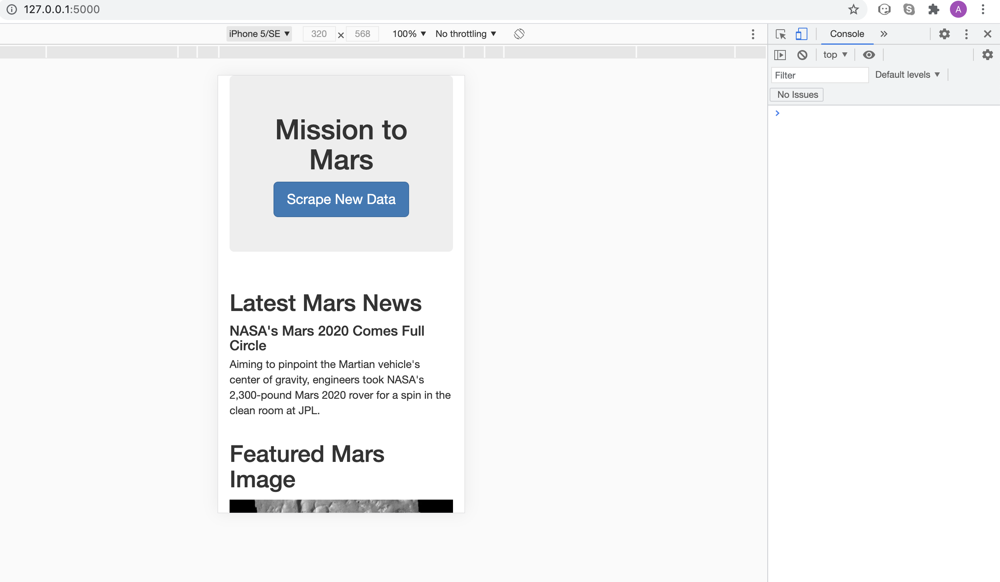

# Overview

In this project, web scraping of a website is performed by using the Python's **Beautifulsoup** library. Scraped contents are pushed into a **Mongodb** table and retrieved via a python **Flask** application server. The application server renders an HTML page and serves dynamic content in it by using **Jinja2** templating. The following diagram shows the flow.


# Deliverable One

The Jupyter file is uploaded. Here, image links and titles of the four Mars hemispheres are scraped from **marshemispheres.com**.

# Deliverable Two

The code is put into a Flasp application. This application renders **index.html** by calling the **scrape()** function (in *app.py*). Behind the scenes, the function **mars_imgs()** is called that scrapes the external URL and gets the titles and image links. Finally, dynamic content is loaded into the **index.html** page, where **Jinja2** templating is used. 

# Deliverable Three

## Mobile support

We can see from the three examples below that Mobile support is activated for the web page by making the page responsive.

### IPAD: Wider Display


### Pixel 2: Narrower Display


### Iphone 5: Narrowest Display


## Enhance Components using Bootstrap

Image Thumbnails code (**img-thumbnail** class was added):

```

```

Button outline code (**btn-outline-dark** class was added):

```
<p><a class="btn btn-primary btn-lg btn-outline-dark" href="/scrape" role="button">Scrape New Data</a></p>

```
